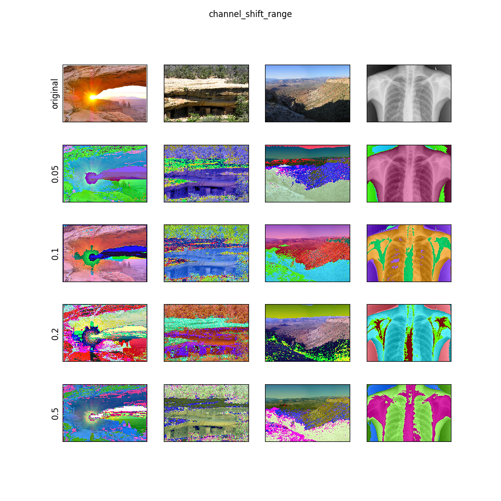

# Image Generator Visualizer

The Image Generator Visualizer (IGV) visualizes the different functions and parameter values for data augmentation with Keras/Tensorflow.

Data augmentation is a technique to increase the data set by randomly modifying the image (e.g. crop, shift). IGV gives an intuition about parameter impact and modification of the images. It tries out each function separately with different parameter values.

IGV can be easy adopted to show data augmentation for a new dataset.
IGV can be easy configured to use different parameter value space.

# ImageDataGenerator

Documentation: https://keras.io/preprocessing/image/  

keras.preprocessing.image.ImageDataGenerator(featurewise_center=False, 
samplewise_center=False, 
featurewise_std_normalization=False, 
samplewise_std_normalization=False, 
zca_whitening=False, 
zca_epsilon=1e-6, 
rotation_range=0., 
width_shift_range=0., 
height_shift_range=0., 
shear_range=0., 
zoom_range=0., 
channel_shift_range=0., 
fill_mode='nearest', 
cval=0., 
horizontal_flip=False, 
vertical_flip=False, 
rescale=None, 
preprocessing_function=None, 
data_format=K.image_data_format()) 

# Note
* fill_mode is only applicable if there is empty space, which requires to be filled (e.g. rotation, shift, zoomout). The visualization function sets height_shift_range = 0.5
* cval is only applicable for fill_mode = 'constant'. The visualization function sets fill_mode = 'constant' and height_shift_range = 0.5
